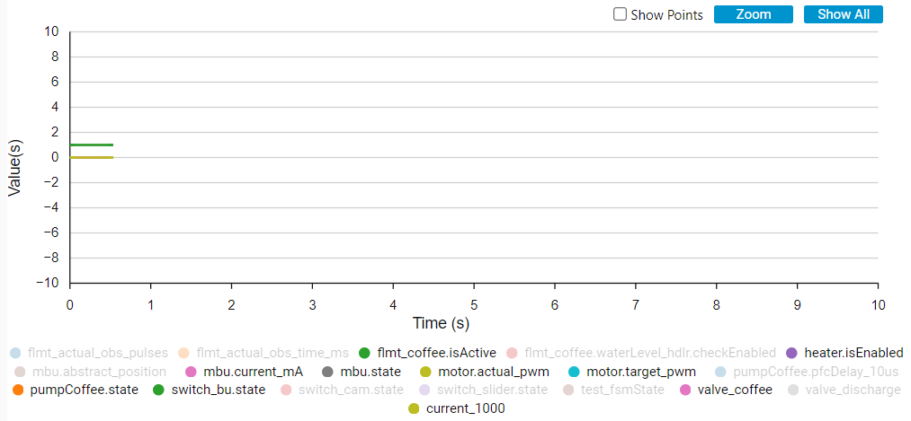

# CubeMonitor_mod

#### Info

Modifyied STM32 chart node:

* Allow to use topic "**clear only time**", to clear graph keeping unselected variables (in grey), saving the visibility, while default "clear" topic select again all variables in graph.

#### Usage

* Paste the folder "`node-red-contrib-stm32cubemonitor`" in path: "`{CubeMonitor installation path}\STM32CubeMonitor\resources\app\node_modules`"
* Chart node should receive the topic "`clear only time`" using a button

